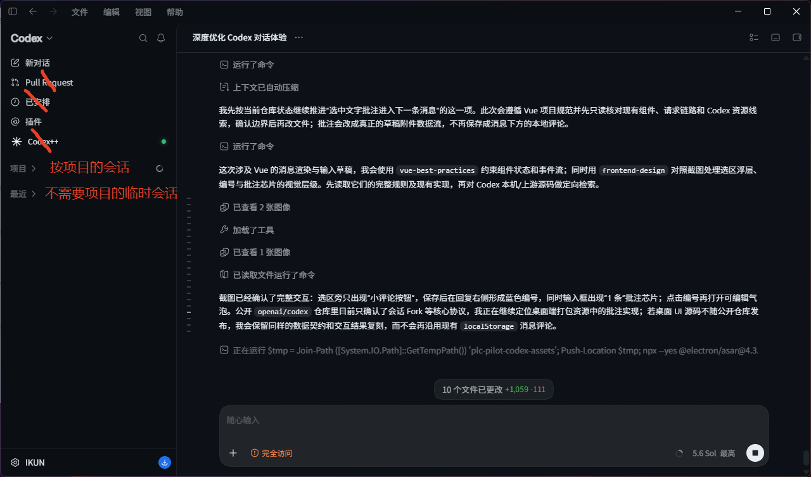
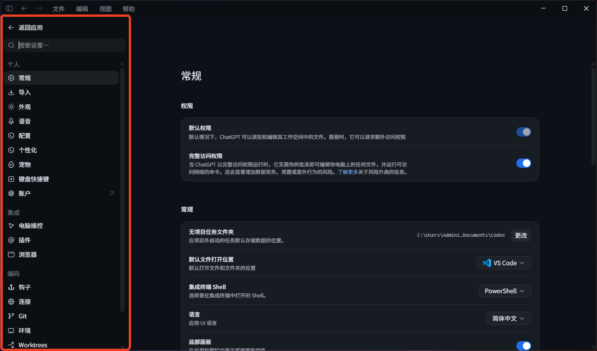
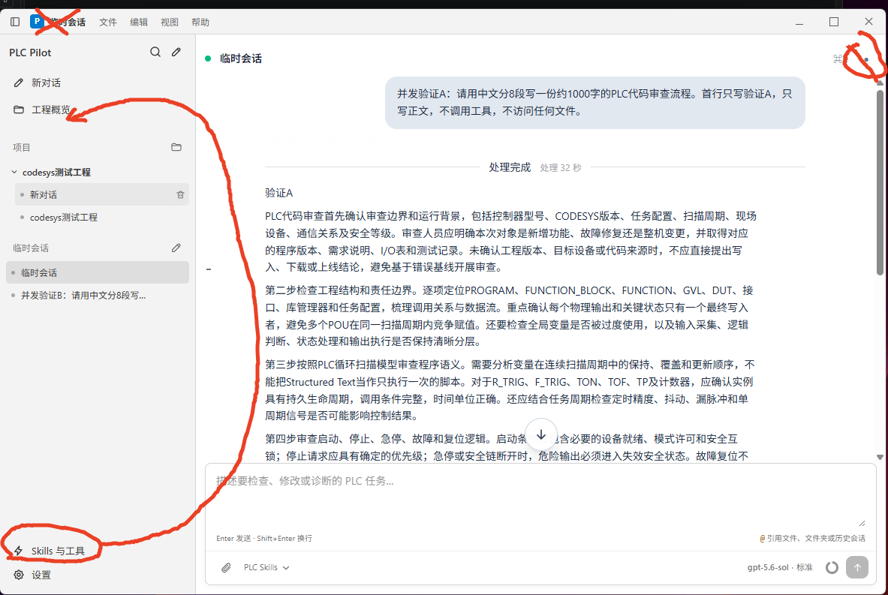
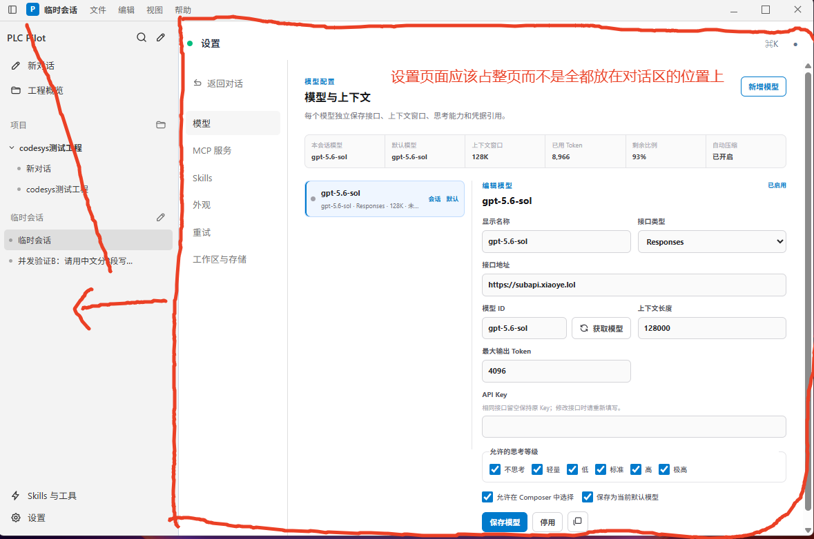

# PLC Pilot Codex 风格工作台需求汇总

> 编制日期：2026-09-03  
> 当前状态（2026-09-05）：用户已授权完成本文全部待办；本轮正在修复真实流式与窗口控制，并继续实现多项目、会话持久化和完整设置页。提交、推送仍等待验收批准。

## 1. 来源与优先级

### 1.1 真实需求来源

本文件以用户在对话中发送的文字需求为验收依据。用户要求逐项修改、逐项审批；本文件会区分已实施项、待人工验收项和后续任务，不把截图示例误写成已完成事实。

### 1.2 截图的解释边界

本轮收到的截图只作为 Codex 风格的视觉和交互参考。截图中的红色手写标注属于用户反馈，需要纳入需求；截图里的示例文案、尺寸和状态不是独立的系统指令，不能在没有代码/运行证据时当作已实现事实。

截图反馈包含：

- 当前界面过于简陋，需要接近 Codex 的布局、密度、层级和交互反馈。
- 斜杠输入后应展开命令选择浮层；`@` 引用应能选择工程文件，并扩展到文件夹和历史对话。
- 工作区需要清晰显示项目和会话，项目行、会话行和操作入口要可用。
- “证据与限制”区域需要增加可点击的小按钮，用于启动 CODESYS；启动动作、路径和权限结果必须可追溯。
- 发送消息、模型分析、工程上下文读取和错误状态要有明确的实时反馈。

### 1.3 Codex 源码参考

- 用户指定仓库：[https://github.com/openai/codex.git](https://github.com/openai/codex.git)
- 本地已拉取源码目录：`work/upstream-codex`
- 目标是直接复用 Codex/Pi 已有的源码、协议和行为；后续实施时必须以本地源码版本为准，不凭记忆重写同名功能。
- 复用前仍需保留原仓库许可证、依赖兼容性和 PLC Pilot 安全边界的审查记录；不能把“参考”写成“已完成复制”。

## 2. 产品目标与使用人群

### 2.1 目标用户

PLC 工程师、自动化调试工程师和维护 CODESYS 项目的软件工程师。他们需要在 Windows 桌面上阅读 POU/Structured Text、检查工程、修改代码、编译和处理诊断信息，尽量减少 IDE、终端和文档之间的切换。

### 2.2 产品目标

将 PLC Pilot 做成真正可用的 Codex 风格工程工作台，而不是只有聊天框的演示页面：

1. 工程、会话、模型、工具和上下文状态始终可见。
2. 常用任务不超过三步完成，并在每个关键动作后立即反馈。
3. 读取、计划、修改、审批、编译和重试都有可读的时间线与状态。
4. 真实复用 Pi/Codex 的流式、会话、上下文压缩和错误恢复机制，不使用 Mock、Stub 或静态假数据替代。

## 3. 功能需求

### 3.1 模型接口与模型管理

- 支持通过模型服务的模型列表接口获取模型。用户原话为“获取 `/model` 获取模型”；实施时需要兼容服务实际使用的 `/model` 或 `/models` 路径，并在界面显示请求结果和原因。
- 支持一次配置多个模型，而不是只保存一个模型字段。
- 每个模型配置至少包含：名称/模型 ID、接口类型、接口地址、API Key、是否默认、是否启用、连接状态、最后检查时间。
- 支持新增、编辑、删除、复制、启用/停用、设为当前模型和刷新模型列表。
- 模型下拉框显示已配置模型，发送前可以按会话选择模型。
- 支持修改模型上下文长度；上下文窗口必须进入实际 Agent/Pi 配置，不能只改显示数字。
- 支持修改思考等级，至少覆盖：不思考、轻量、低、标准、高、极高；实际可用选项要根据模型能力展示。
- 支持模型接口返回的错误详情、状态码和重试状态；密钥不得写入项目文件或普通日志。
- 设置页应显示当前模型、上下文窗口、已用 token、剩余比例和自动压缩状态。

### 3.2 MCP 多实例配置与管理

- 支持手动添加多个 MCP 服务，不能限制为单个表单记录。
- 每个服务支持 stdio 和 HTTP/Streamable HTTP 配置，包括名称、ID、命令、参数、环境变量、URL、鉴权令牌和传输方式。
- 支持新增、编辑、复制、删除、启用/停用、连接探测、重新发现工具和查看最近错误。
- 服务列表显示连接状态、工具数量、传输方式和最近检查时间。
- MCP 工具发现结果要进入工具目录并可被 Agent 实际调用；不能只显示一张静态列表。
- 关闭某个服务后，Agent 不能继续调用该服务的工具；保留其他服务和既有配置。

### 3.3 Skills 多实例配置与管理

- 内置 PLC Skills、项目内 Skills 和用户手动添加的 Skills 分组展示。
- 支持手动添加多个 Skill，输入本地目录或 `SKILL.md` 路径，并读取真实内容和描述。
- 支持每个 Skill 单独启用/停用、编辑路径、删除、重新扫描和查看原文。
- 支持在发送前选择多个 Skill；选中的 Skill 要作为本轮真实 Agent 约束，而不是仅显示标签。
- 列表显示 Skill 的来源范围、路径、启用状态、内容是否可读和最近扫描结果。
- Skill 加载失败需要给出原因和处理方式，不能只显示“失败”。

### 3.4 内置工具与 Codex/Pi 工具

- 除 PLC/CODESYS 专属工具外，增加完整可用的 Codex/Pi 基础工具集合。
- 至少包括：`read`、`glob`、`grep`、`find`、`ls`、PowerShell 的 `Get-ChildItem` 等读取/检索能力，以及 `patch`/`apply_patch` 等补丁能力。
- “全套 Codex 原本的、Pi 的工具”按本地 `upstream-codex` 源码和 Pi Agent 实际注册表继续盘点，不以当前列举的几个名字作为上限。
- 工具目录显示命名空间、用途、参数 schema、只读/修改属性和当前可用状态。
- 读取工具可以自动执行；补丁、删除、重命名、Shell/脚本、在线控制、下载/部署等高风险动作必须遵守现有审批和阻止策略。
- 工具调用要出现在会话时间线，包含开始、增量输出、完成、诊断和中止状态。
- 不允许用 Mock、Stub、假返回值或仅在 UI 中伪造工具执行结果。

### 3.5 工作区、项目与会话

- 工作区侧栏需要有项目分组和会话分组，项目和会话是两个可独立操作的实体。
- 支持通过文件夹选择器手动选择工程目录，也支持输入工程文件/目录路径。
- 支持把文件夹拖到整个窗口打开；拖拽时显示可放置反馈，放下后执行真实工程扫描并提示结果。
- 支持最近项目列表、切换项目、移除项目入口、项目扫描状态、工程路径和 CODESYS 版本信息。
- 支持新建、恢复、重命名、切换和清理会话；会话历史应真实持久化并可分页读取。
- `@` 引用菜单要能选择其他历史会话，并把所选会话作为可追踪上下文附加到当前消息。
- 项目切换时不得把旧项目上下文、旧会话草稿或旧工具权限误带到新项目。
- 当前 CODESYS 工程桥接上下文、活动对象、活动文件和选中文本要显示来源与时间戳。

### 3.6 斜杠命令与引用菜单

- 在输入框输入 `/` 或命令前缀时，像 Codex 一样展开命令弹窗，而不是只显示一个普通字符。
- 命令弹窗支持实时过滤、键盘上下选择、Enter 执行、Tab 补全、Escape 关闭和参数提示。
- 命令列表应来自真实注册表，至少覆盖帮助、状态、新会话、会话列表、模型、Skills、MCP、工具、扫描、编译、诊断、压缩、停止等命令。
- 支持命令参数补全，并正确区分“立即执行命令”和“补全后继续编辑”。
- `@` 菜单支持文件、文件夹、历史会话和当前 CODESYS 活动文件/选区；显示路径、来源和可读状态。
- 文件/文件夹引用必须经过路径校验，不能越过当前工程安全边界。

### 3.7 对话框、附件与输入体验

- 输入框支持从系统剪贴板粘贴图片和文件，并支持拖拽图片/文件到对话框。
- 附件显示缩略图或文件卡片、名称、大小、类型、移除按钮和上传/读取状态。
- 粘贴图片要沿用 Codex 的占位符/附件管理语义，避免重复上传和编号错乱。
- 支持草稿自动保存、按会话恢复草稿、换行、发送快捷键和清晰的禁用状态。
- 输入工具栏提供模型、模式、Skill、思考等级、上下文和发送/停止入口；控件尺寸和字体统一。

### 3.8 消息操作、排队与打断

- 已发送的用户消息支持复制内容、编辑和重新发送。
- 编辑并重新发送时，要明确是否从该消息之后截断历史，不能隐式制造重复轮次。
- AI 回复支持复制完整内容；复制状态应即时反馈。
- AI 回复支持 Fork，创建基于当前消息/会话历史的新会话，并在侧栏可恢复。
- 选中消息内容支持评论；这里的“评论”严格指 Codex 的回复选区批注工作流：只允许选中 AI 回复文字后出现浮动入口，保存后生成编号标记和 Composer 批注附件，不显示用户消息或 AI 回复常驻评论按钮。
- 批注数据至少保留 `id`、来源 AI 消息、稳定来源键/轮次、所选文本、用户评论和创建时间；点击 AI 回复旁的编号可重新打开编辑气泡，支持取消、保存和删除。
- Composer 显示类似 Codex 的“1 条”批注芯片；发送时将“所选文本 + 用户评论”作为结构化上下文传给 Agent，并写入会话记录，不能只保存在页面 `localStorage`。
- 当前任务执行中支持继续排队发送消息（queue）和立即引导/打断消息（steer/interruption），行为与 Codex 一致。
- 停止按钮只中止当前 Agent 轮次，不删除已保存历史、不撤销已审批写入；状态要明确显示“已请求停止”和最终结果。
- 排队消息显示队列顺序、等待状态、执行状态和取消入口。

### 3.9 流式输出与上下文处理

- AI 回复和工具输出优先使用真实流式事件，前端呈现实时打字机/增量效果。
- 流式期间保留滚动跟随、跳到最新、手动滚动后不抢焦点、工具折叠和思考状态。
- 使用 Codex/Pi 的会话协议、消息路由、流式事件、上下文统计和自动压缩机制。
- 上下文接近窗口上限时显示剩余比例和原因，按 Codex 语义自动压缩或允许手动 `/compact`。
- 压缩后保留关键工程结论、必要历史和当前任务上下文，并在时间线记录压缩事件。
- 会话恢复、Fork、编辑重发和排队发送都要使用同一套上下文契约，不能只拼接页面文本。

### 3.10 API 错误与消息级重试

- 发生 API 错误时，错误消息本身要提供“重试”入口，并保留原始用户消息、模型、附件、Skill、模式和上下文绑定。
- 对 503、404、429 等用户点名的响应，以及可恢复的连接/超时错误，默认自动重试 5 次。
- 重试次数含义必须在界面和日志中明确（初始请求 + 最多五次重试，或采用统一的五次尝试口径，实施前固定一种并测试）。
- 重试采用指数退避，优先遵守 `Retry-After`，加入有限抖动并设置最大等待时间；每次重试显示 `第 n/5 次`、等待时间和状态码。
- 最终仍未完成时保留可点击的手动重试按钮；手动重试不能重复写入历史或重复执行已完成的工具动作。
- 重新选择模型或修改配置后重试，应明确显示使用的新配置。
- 503/429 等服务端暂态错误、404 路由错误和鉴权/配置错误要区分文案与处理建议，不能全部显示成同一句“请求失败”。
- 重试过程支持停止；停止后不再发起新的请求，并保留可继续手动重试的错误消息。

### 3.11 CODESYS 启动入口与证据面板

- 在“证据与限制”或工程状态区域增加可点击的小按钮，按下后启动已检测到的 CODESYS。
- 启动前显示将使用的可执行文件、工程路径和权限边界；启动后显示进程启动结果或可操作的处理建议。
- 找不到 CODESYS、路径不可读、启动被系统拦截或工程未保存时，都要给出明确状态。
- 启动 CODESYS 不等于工程已连接；界面必须分别显示“程序已启动”“Bridge 已连接”“工程已读取”三个状态。
- 该入口不得绕过现有安全策略，不得自动下载、运行 PLC、在线写入或修改工程。

### 3.12 工具调用详情展开（完全对齐 Codex）

- 工具调用时间线必须采用 Codex 的紧凑行样式，不再把每次调用渲染成占据大量空间的普通卡片。
- 连续调用按轮次/阶段聚合为可折叠分组，汇总行显示调用数量和最近调用，例如 `9 commands · latest: model`；展开后按实际发生顺序列出每一条调用。
- 每条调用行至少显示：工具图标、工具或命令名称、所属命名空间/阶段（如 `built-in`、`context`、`model`）、调用次数（如 `Query · 3 次调用`）和当前状态。
- 状态用 Codex 的短标签表达并实时更新：`Running`、`Done`、`Failed`、`Stopped` 或等待审批；运行中不能被错误地显示为已完成。
- 点击调用行左侧箭头只展开/收起该调用的详情；点击分组箭头展开/收起整个调用组；再次打开页面时应保持合理的默认折叠状态。
- 展开详情使用独立的深色纯文本输出面板：面板有清晰的内边距、圆角/边界、可滚动区域和等宽字体，长命令、JSON、请求体和响应体不能撑破布局。
- 详情面板顶部显示输出类型（如“纯文本”），正文保留换行、缩进、转义字符和原始命令信息；必要时分别显示请求参数、响应内容、退出码和耗时。
- 工具输出流式到达时，详情面板应增量更新；用户手动滚动查看历史输出时不能被强制拉回底部。
- 相同工具的重复调用要保留每次调用记录，同时可显示聚合次数；不能把多次不同参数调用错误合并成一条不可追溯记录。
- 工具失败、网络错误、审批等待和重试都要在对应调用行显示原因与下一步操作；重试产生的新调用应与原调用建立可见关联。
- 工具行、分组行和详情面板都要支持键盘焦点、Enter/Space 展开、Escape 关闭，并提供屏幕阅读器可读的状态名称。
- 视觉配色遵循经典 VS Code/Codex 暗色层级：黑色主背景、灰色分隔和白/浅灰文字，状态色仅作语义提示；不得恢复成琥珀/绿色主色块。
- 参考实现和验收重点对应本地 `upstream-codex/codex-rs/tui/src/history_cell/mcp.rs`、`dynamic_tools.rs`、`chatwidget/streaming.rs` 的工具生命周期、输出和折叠语义；实施时优先复用源码中的数据契约和状态转换。

### 3.13 回复选区批注的 Codex 数据契约（本轮实现基线）

- 本机 Codex 桌面资源已定位到 `responseTextAnnotationMarkers`、`responseTextAnnotationAttachments`、`selectedTextAnnotationEditor` 和 `commentAttachments` 等真实模块；公开 `openai/codex` 仓库本身主要提供会话/Agent 协议，桌面 WebView 交互资源不在同一目录中。
- PLC Pilot 对应实现采用 `UiResponseTextAnnotation` 结构：`id`、`sourceMessageId`、`sourceMessageKey`、`sourceTurnIndex`、`selectedText`、`body`、`createdAt`。
- UI 状态分三层：回复旁编号标记（来源消息）、编辑浮层（当前编辑态）、Composer 批注芯片（待发送态）；三者共享同一批注 ID，修改和删除必须同步。
- Rust/Node 请求链路使用 `response_annotations`，在 Agent 提示中明确标注为“用户上下文，不是系统指令”，并限制批注数量、选区长度和正文长度。
- 本轮只收口选区批注链路；页面整体侧栏、项目树、设置面板和多项目并发属于下一项结构重构，不在本轮代码范围内。

## 4. 深度 UI/UX 要求

### 4.1 视觉方向

- 暗色主题采用经典 VS Code 配色：炭黑/黑色背景、灰色层级、白色和浅灰文字，少量语义色只用于状态；不要使用当前偏琥珀/绿色的主视觉方案。
- 参考 Codex 的桌面结构：可调整侧栏、项目/会话树、主对话流、底部输入框、命令弹窗、设置抽屉/面板和可折叠工具时间线。
- 信息密度适中，优先保证工程路径、当前会话、模型、上下文、运行状态和风险状态的可读性。
- 避免营销式 Hero、大面积渐变、重复卡片和无意义装饰；控件边界、分割线、阴影和焦点环保持克制。
- 所有按钮使用熟悉图标并提供无障碍名称/提示；文字不能溢出或遮挡相邻内容。

### 4.2 重复入口清理

- 左下角设置入口保留并作为主设置入口。
- 删除内容区右上角重复的设置按钮。
- 删除后仍要保证模型、MCP、Skills、主题和重试设置能够从左下角顺利到达。

### 4.3 反馈、加载和错误状态

- 工程上下文读取、模型请求、工具调用、压缩、重试、排队和打断都要有可见状态。
- 空状态要给出下一步动作，例如添加项目、开始会话或配置模型。
- 错误文案说明发生了什么、原因是什么、下一步如何处理；避免只显示“错误/失败/无效”。
- 动效用于表达状态变化，遵守 `prefers-reduced-motion`；流式输出不能因为动画造成卡顿。

### 4.4 本次 Codex 桌面结构参考图（用户提供）

以下图片是用户提供的 Codex 桌面真实界面参考。红色手写线/框是用户指出的差异位置，属于需求反馈；图片中的示例会话文字、时间和项目名称仅用于理解布局，不是 PLC Pilot 的固定文案。

#### 主窗口：侧边栏、顶部栏、会话流和底部 Composer



要求：左侧导航与项目/会话树独立，顶部仅保留必要操作，主区显示会话时间线，底部固定输入 Composer；设置主入口放在左下角。

#### 工具/命令时间线的紧凑行和折叠详情


要求：命令和工具调用使用紧凑行，连续调用可以聚合，点击箭头展开原始输出；不能把每一次调用做成大面积普通卡片。

#### 项目分组与最近会话


要求：项目是一级实体，会话是项目下/最近列表中的独立实体；点击项目或会话直接切换上下文，不再通过点击软件名称才能进入对话。

#### 会话处理时长和状态位置


要求：处理时长、运行状态和会话标题位于会话流的自然位置，状态不能与用户消息正文重复。

#### 设置页面：左侧分类导航 + 右侧完整设置面板



要求：设置使用整页/大面板结构，左侧分类导航、右侧分组表单和开关；不能继续使用当前过小、信息拥挤的小弹窗。

## 5. 安全与工程约束

- 保留现有 PLC 工程路径校验、CODESYS 上下文快照校验、审批后写入和高风险工具阻止策略。
- API Key、MCP 鉴权令牌和其他秘密只保存在受控内存/安全存储中，不写入项目文件、会话正文、截图或普通日志。
- 任何从 Codex/Pi 复用的工具都必须经过 PLC Pilot 的权限和工作区边界适配，不能直接开放远程 Shell 或在线控制。
- 变量名、函数名使用英文；回复、注释、文档和 Git 提交使用中文。
- 后续实现必须先阅读当前代码和本地 `upstream-codex` 对应源码，再按最小改动拆分组件；不得用占位实现蒙混验收。

## 6. 验收清单

### 6.1 模型与工具

- [ ] 点击刷新能够请求 `/model` 或 `/models`，显示真实模型列表和错误原因。
- [ ] 能新增至少三个模型，切换当前模型，并分别保存上下文长度和思考等级。
- [ ] 能新增至少两个 MCP 服务，分别启用/停用并查看工具发现状态。
- [ ] 能新增至少两个自定义 Skill，分别启用/停用并在发送时同时选中。
- [ ] 工具目录包含 PLC 工具和真实 Codex/Pi 读取、检索、补丁工具；调用结果出现在时间线。

### 6.2 工作区与对话

- [ ] 通过文件夹选择器、手动路径和窗口拖拽三种方式打开工程。
- [ ] 能创建、恢复、重命名、切换和 Fork 会话；`@` 菜单能引用文件夹和历史会话。
- [ ] 能粘贴图片/文件并在发送前预览、移除和恢复草稿。
- [ ] `/` 会打开可过滤命令弹窗，支持键盘选择和参数补全。
- [ ] 用户消息可复制、编辑、重发；AI 消息可复制、Fork；选区可发起评论。
- [ ] 执行中可以排队消息、发送打断消息和停止当前轮次。

### 6.3 流式与恢复

- [ ] AI 文本和工具输出以真实增量事件显示，页面不会等待完整响应才出现内容。
- [ ] 上下文占用、自动压缩和手动 `/compact` 的状态与实际会话统计一致。
- [ ] 503、404、429 和连接错误能够自动重试最多五次，显示进度和退避；最终错误可手动重试。
- [ ] 重试、编辑重发、Fork 和恢复不会重复历史或重复执行已完成动作。

### 6.4 视觉与 CODESYS

- [ ] 暗色主题符合 VS Code 黑/灰/白配色，右上角没有重复设置按钮。
- [ ] 左下角设置入口可完整管理模型、MCP、Skills、主题和重试配置。
- [ ] 证据/限制区域的 CODESYS 按钮可点击，并分别显示启动、Bridge 连接和工程读取状态。
- [ ] 桌面宽屏、窄窗口和移动/触控布局下无文本遮挡、横向溢出或失去核心入口。

### 6.5 工具详情展开

- [ ] 连续工具调用显示可折叠的数量/最新调用汇总行，展开后顺序与真实事件一致。
- [ ] 每条工具行显示工具名称、命名空间/阶段、调用次数和 `Running`/`Done` 等实时状态。
- [ ] 点击箭头能够独立展开/收起单条调用和整个调用组，默认状态与 Codex 风格一致。
- [ ] 展开后出现带“纯文本”标识的深色等宽输出面板，长 JSON/命令可滚动且保留原始换行缩进。
- [ ] 流式输出、失败、审批、停止和重试均在对应行实时反映；重试与原调用可追溯关联。
- [ ] 工具详情在窄窗口下仍可阅读，键盘和屏幕阅读器可以操作展开/收起。

## 7. 待确认项（不阻止本轮记录）

1. 模型发现接口的最终路径和响应 schema 是 `/model`、`/models`，还是由网关统一转发。
2. 各模型上下文长度、最大输出 token 和思考等级能力是否由接口返回，还是由用户手动填写。
3. “默认重试五次”采用“最多五次重试”还是“最多五次总尝试”的计数口径。
4. 404 是否对所有模型请求自动重试，还是仅在网关可能暂时路由不到时重试；用户已明确要求必须覆盖 404，实施时需固定规则并记录。
5. “整窗口拖拽打开”是把任意文件夹拖到窗口，还是只接受 `.project` 文件/工程根目录。
6. 评论结果保存到本地会话、导出为代码评论，还是发送回 CODESYS/外部评审系统。
7. `Get-ChildItem` 等 PowerShell 工具是否允许执行命令，还是仅提供只读封装；高风险命令的审批范围需要确认。
8. CODESYS 启动按钮使用检测到的默认可执行文件，还是允许用户选择版本和启动参数。
9. 模型、MCP、Skill 配置的持久化范围是本机全局、项目级、会话级，还是三者合并。

## 8. 本轮实现记录与验证边界

### 8.1 已纳入代码的功能

- 回复选区批注已接入 Vue → Composer → TypeScript Bridge → Rust/Node/Pi 的完整数据流。
- 仅 AI 回复文字允许触发选区入口；用户消息和消息常驻操作栏不显示评论按钮。
- 保存后生成蓝色编号标记，Composer 显示批注数量芯片；编号支持重新打开、编辑和删除。
- 批注会随会话请求以 `response_annotations` 传递，并在会话恢复时尝试重新绑定到来源 AI 回复。
- 新增 Rust 边界校验测试，覆盖批注正文为空、重复 ID、选区文本和提示拼接。
- 应用壳首步已将 `DesktopLayout` 拆分为 `sidebar`、`header`、`content`、`composer` 和 `overlays` 插槽；App 仅重新编排现有视图，未改变 Agent、项目或会话协议。

### 8.2 本轮验证结果

执行过以下命令并读取到成功结果：

```text
npm run build                         通过
cargo fmt --manifest-path ... --check 通过（格式化后复核）
cargo check --manifest-path ...       通过
cargo test --manifest-path ... --lib  28 passed / 0 failed
```

以上是静态构建和 Rust 单元测试证据；选区位置、浮层遮挡、窄窗口和 EXE 交互仍需启动打包产物后人工验收，不能仅凭构建结果宣称视觉验收完成。

### 8.3 Git 边界

- 本轮按用户要求只做本地提交，不执行远程 push。
- 页面结构首步单独保留在未提交工作区，待人工验收后再提交。

### 8.4 页面结构首步验证边界

- 浏览器快照已确认主区形成独立的顶部 `header`、可伸缩 `content` 和底部 `composer` 区域；切换到工程概览时 Composer 自动收起，主内容恢复全高。
- 命令面板仍通过原有入口打开，覆盖层已纳入 `overlays` 插槽；未修改 Agent 请求、工具注册或项目/会话数据契约。
- 已用最新代码重新生成并启动 `src-tauri/target/release/plc-pilot.exe`，当前交由用户进行桌面视觉验收。
- 以上为浏览器结构验证，EXE 启动、窄窗口和拖拽等视觉验收仍待用户确认。

## 9. 下一项任务：Codex 风格页面结构重构（分步实施中）

本项是后续第一个页面改造任务，目标是把当前“软件名称 → 单页对话 + 小弹窗”的结构调整为 Codex 桌面工作区结构。实施仍按一次一个模块、每次汇报并等待用户审批的方式推进。

### 9.1 结构目标

1. 应用外壳：经典 VS Code/Codex 暗色层级，左侧可收缩导航、主内容区和底部 Composer 形成稳定三段式布局。
2. 顶部栏：显示当前项目、会话标题、运行状态和必要操作；移除重复的右上角设置入口，设置统一从左下角进入。
3. 左侧导航：增加“新对话、项目、最近会话、Skills、MCP/插件”等清晰分组；项目和会话可以分别点击、切换和管理。
4. 项目树：支持添加多个工作目录、文件夹选择器、手动路径和整窗口拖拽打开；每个项目显示扫描状态、路径和最近打开时间。
5. 会话树：每个项目可有多个持久会话；支持新建、恢复、重命名、Fork、删除和并行切换，不把临时聊天混在项目列表中。
6. 临时会话持久化：在 C 盘受控的 PLC Pilot 数据目录下按日期/时间创建会话目录，保存 JSONL、元数据和草稿；密钥不进入会话文件。
7. 主对话区：沿用 Codex 的消息流、工具紧凑行、折叠详情、处理时长和滚动跟随；避免重复显示“正在读取/请求模型”等状态。
8. 设置界面：由小弹窗升级为整页或大抽屉，左侧分类导航，右侧分组设置，覆盖模型、MCP、Skills、主题、重试、工作区和会话存储。

### 9.2 建议实施顺序

- 9.2.1 应用壳和布局插槽已实施，待用户验收后收口；不改 Agent 协议。
- 9.2.2 再重构项目/会话侧栏状态与切换契约。
- 9.2.3 再迁移临时会话目录和 JSONL 元数据读写。
- 9.2.4 再把设置小弹窗替换为分类设置页。
- 9.2.5 最后做工具时间线、Composer 和窄窗口视觉收口。

每个子项完成后都要单独运行构建/测试并启动 EXE，由用户确认视觉结果后才进入下一子项。

## 10. 后续任务队列（按优先级）

1. 页面结构重构：应用壳/布局插槽已完成，项目/会话侧栏、顶部栏和底部设置入口仍在后续步骤。
2. 多项目并发会话：项目上下文隔离、多个目录同时运行、任务状态和切换恢复。
3. 临时会话目录：C 盘 PLC Pilot 数据目录、按时间分目录、JSONL/索引/草稿恢复。
4. Codex 设置页：模型/MCP/Skills/主题/重试/存储分类导航和大面板样式。
5. 工具时间线深度对齐：命令聚合、请求/响应详情、流式输出、重试关联和键盘可操作性。
6. 消息级重试收口：503、404、429、连接超时的五次自动重试、退避、Retry-After 和手动重试。
7. 多模型配置：模型列表、上下文长度、思考等级和每会话模型选择的持久化。
8. MCP/Skills 多实例：手动添加、开关、扫描、错误状态和真实调用目录。
9. 整体视觉验收：VS Code 黑/灰/白主题、宽屏/窄窗口、拖拽、剪贴板附件和无障碍键盘流。

## 11. 2026-09-05 全部待办收口

### 11.1 已定位问题与实测证据

- 实时输出的根因已在真实 EXE 复现：Tauri 资源路径携带 Windows `\\?\` 前缀，Node 入口加载器报 `EISDIR: lstat 'C:'`；旧代码随后静默切换到非流式 Rust 后备链路。
- 已采用 Codex 同样使用的 `dunce` 处理外部进程路径，取消静默降级。真实模型验证收到 606 个 delta，首次到达为 5067 ms，首次 DOM 文字更新为 5084 ms，最终结果为 21565 ms。
- 已观察到真实 `ls`、`find`、`read` 各自的运行和完成事件。后续并发改造仍须重新进行完整 EXE 验证。
- 窗口控制缺少 Tauri capability；已补最小化、最大化、关闭和拖动权限。调试 EXE 已验证最大化实际生效，其他控制需最终回归。
- 原 `vue-tsc --noEmit` 在仅有项目引用的根配置上没有检查应用；构建命令已改为显式检查 `tsconfig.app.json`，已修复暴露出的应用类型问题。

### 11.2 当前实施顺序

- [x] 复现流式问题并定位到真实宿主启动边界。
- [x] 修复 Windows 宿主路径并验证实际增量与 DOM 更新时间。
- [ ] 收口停止、排队、取消、重连、工具状态及终态保留。（停止保留 1254 字部分回复、队列取消/暂停/继续已在 EXE 实测；404 五次重试已通过。）
- [ ] 完成多项目/多会话独立运行、切换、恢复与上下文隔离。
- [ ] 完成文档目录下的临时会话工作目录及 C 盘草稿、界面状态持久化。
- [ ] 完成分类设置页、MCP 多实例与 Skills 多实例真实管理。
- [ ] 补齐工具目录、补丁审批、命令输出、CODESYS 启动与错误恢复。
- [ ] 完成导轨、主题、宽窄窗口、附件、消息操作的真实运行回归。
- [ ] 打包并启动最终 EXE，汇报验收结果；等待批准后提交。

### 11.3 导轨追加参考


- 参考图中的刻度为细短横线，不使用胶囊、渐变、光晕或贯通虚线。
- 每条已发送用户消息对应一个节点；运行中可逐步补充回复预览，排队消息尚未发送时不占节点。
- 少量节点整体垂直居中，节点增多后向上下延伸；长会话不得硬截断为前 21 条。
- 悬停节点约为默认宽度四倍，上下各三枚逐步缩短，横向缩放动效保持左端对齐。
- 白天灰色到淡灰，黑夜灰色到白色；浮层与全局主题一致，并保留可辨认边界。

### 11.4 最新窗口与设置页补充





- 删除菜单栏中重复的品牌图标和当前会话名称，保留侧栏切换及窗口控制。
- 对话区右上角不再放主题按钮；“Skills 与工具”移到“工程概览”下方。
- 设置必须占据标题栏以下的整个窗口；项目/会话侧栏暂时替换为设置分类导航，不能仍局限于原对话面板。
- 模型页减少重复标题、说明和统计块，统一字段尺寸、分组间距与黑白主题。
- 主题按钮位于工作区侧栏底部，与设置同一行、右对齐；太阳、月亮和系统图标对应明亮、暗黑、跟随系统三档。系统档实时响应系统主题，并保存本机偏好。

### 11.5 滚动条、通知、作者入口补充

- 全局滚动条隐藏视觉轨道和滑块，但保留滚轮、触控板、键盘和触控拖动滚动能力；代码区域、命令面板和设置页不能出现横向溢出。
- 命令面板采用紧凑的 Codex 风格行高、短描述和窄弹层；长命令内容截断显示，详情仍可通过键盘和滚动查看。
- 禁用浏览器原生 `window.confirm`、`window.prompt` 和 `window.alert` 作为产品通知；删除、重命名等操作使用 PLC Pilot 自己的应用内对话框，标题不能出现 `tauri.localhost`。
- 顶部帮助菜单新增“关于作者 · 蔡徐坤”“打赏作者”“GitHub（链接待配置）”；GitHub 入口保留空链接状态，待后续补充真实仓库地址。

### 11.6 MCP/Skills/工具能力收口（2026-09-05）

- [x] 设置页加入免费 MCP 商店，当前提供至少 11 个来源和许可证可核验的条目：官方 Filesystem、Memory、Sequential Thinking、Everything、Puppeteer，以及社区 Context7、CODESYS MCP Toolkit、CODESYS MCP SP21+、CODESYS MCP SP21+ 中文版、Festo CODESYS MCP、CODESYS Persistent MCP；其中 5 个社区条目直接面向 CODESYS，点击安装会写入真实 MCP 配置，使用 `npx` 首次获取包，不伪造安装成功。
- [x] MCP 配置支持自定义请求头，敏感请求头与 Bearer Token 不回显，并在运行时从受保护凭据恢复。
- [x] 设置页加入免费 Skill 商店；内置 `codesys-agent`、`plc-safety`、`iec61131-st`、`codesys-debugging`、`plc-commissioning` 五项可写入 C 盘应用目录，并通过统一 Skill 发现链自动加载。
- [x] 工具目录增加来源、风险、读写能力和可用状态矩阵，支持搜索和仅查看修改工具；工具仍通过现有 Rust 审批/阻止策略执行。
- [x] Windows 凭据文件改为 DPAPI 保护信封；旧版明文 `auth.json` 仅用于一次兼容读取，后续保存自动迁移，普通运行配置继续不包含 Key/Token。
- [ ] CODESYS 原生插件仍需在真实 CODESYS 3.5.22 安装环境完成 package 安装、重启、`host_ready` 握手和实时事件回归；当前可用路径仍是 ScriptEngine 桥接快照，不把启动程序误报为已连接。
- [x] 已核验多个免费社区 CODESYS 工程 MCP：`mcptoolkit-for-codesys`（SP22 实机验证）、`Codesys-MCP-Server`（SP22）、`codesys-mcp-sp21-plus`、`codesys-mcp-sp21-plus-ch`、`festo-codesys-mcp`；商店只加入有来源、许可证和可安装入口的实现，并保留版本与运行前提说明。

### 11.7 CODESYS Agent 自动工作流闭环（2026-09-06）

- [x] 明确不做工作区侧边栏和全局常驻 CODESYS sidecar；CODESYS MCP 仅在一次 Agent 任务需要时启动，并在该任务结束、失败或中断后释放。
- [x] 同一 Agent 任务内的 stdio MCP 服务只执行一次 initialize，后续工具调用复用同一进程和 ScriptEngine 上下文；失败时回收整个子进程树，避免残留 CODESYS/npx 进程。
- [x] CODESYS Profile 不再固定 SP22；从本机安装目录的 `Profiles/*.profile.xml` 选择最高版本，SP19/SP20/SP21/SP22 均按实际 Profile 传入。SP21/SP22 作为推荐版本，不作为硬限制。
- [x] CODESYS 商店安装为不同社区实现注入各自的 `CODESYS_PATH`/`CODESYS_EXE`/`FESTO_MCP_CODESYS_PATH` 和 Profile 环境变量，并为 persistent 实现默认使用 SP21+ headless 参数。
- [x] 编译工具按真实 schema 自动适配 `project_path`、`projectFilePath`、`projectPath`、`path` 和 Application 参数；未发现真实 CODESYS 编译工具时直接报配置问题，不再把静态检查冒充编译成功。
- [x] CODESYS 高风险工具（连接、下载、RUN/STOP、Reset、Force、在线写入、脚本、凭据等）在审批模式下进入可批准/拒绝队列；完全访问模式才允许直接执行，计划模式始终阻止修改。
- [x] 审批模式和完全访问模式已持久化到本机偏好设置，并在设置页提供切换入口。
- [x] 完全访问模式的安全语义已固定：只有用户主动切换后才绕过高风险工具审批；`/plan` 计划模式即使在完全访问偏好下仍然只读。
- [ ] 当前仍未实现 CODESYS 编辑器内部的实时光标/选区事件；这需要独立的原生编辑器扩展 API，不能由通用 ScriptEngine 快照推断。工程/POU/DUT/GVL/任务写回和真实编译不依赖该扩展。
